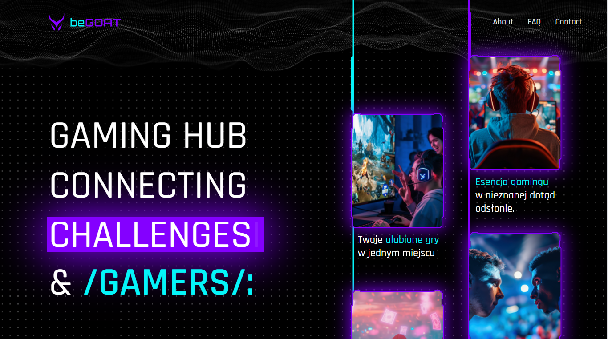

# Gaming platform landing page template
**Project made for for MU Interactive Sp. z o.o. All rights reserved.**

This project showcases a dynamic, responsive, and visually appealing landing page designed for gamers to connect, explore, and participate in the gaming community.

## Table of Contents

- [Usage](#usage)
- [Features](#features)
- [Technologies Used](#technologies-used)

## Usage

To check how this project looks simply visit [begoat.gg](#https://begoat.gg/)

## Features

- **Responsive Design:** Optimized for desktop and mobile views.

- **Interactive Header:** Includes auto-typing effects, animated graphics, and vibrant call-to-action elements.

- **Media Integration:** Embedded videos with a play button overlay.

- **ASCII animatios:** Animations based on ASCII characters.

- **CTA:** CTA forms included.

## Technologies used

- **HTML5:** Semantic and accessible markup.

- **CSS3:** Advanced styling with animations and responsive design.

- **JavaScript:** For interactivity (e.g., navbar toggle, form validation).